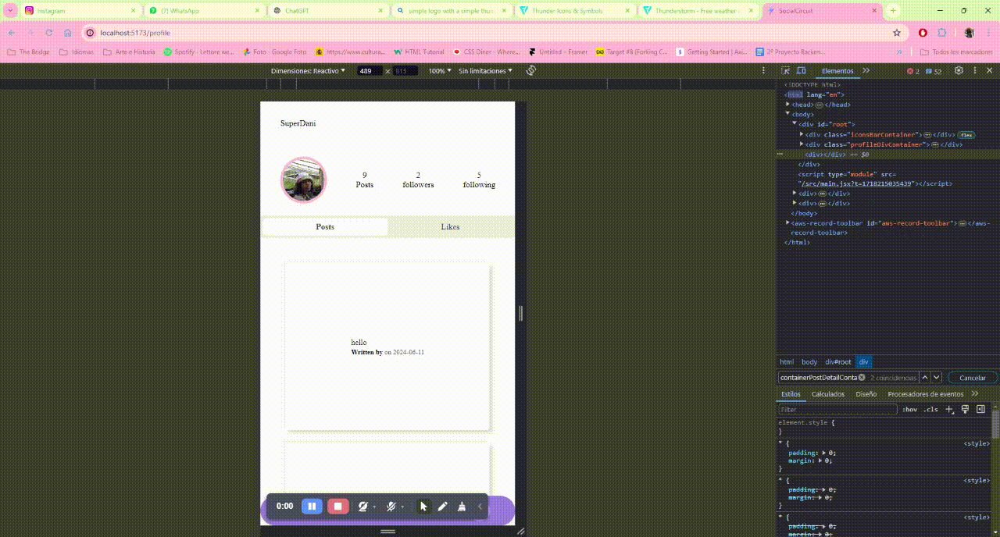
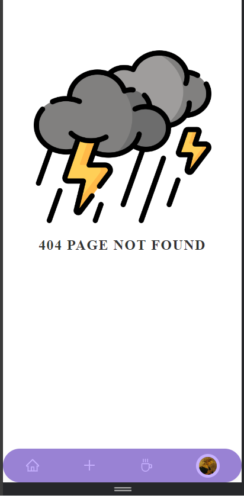
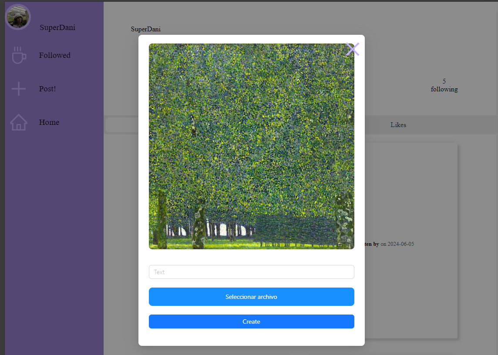
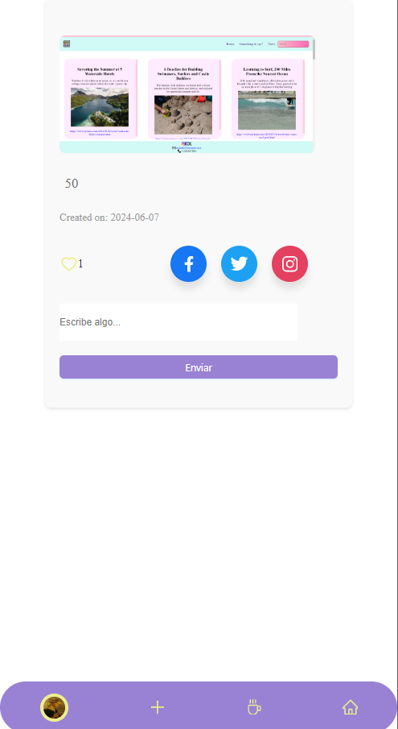
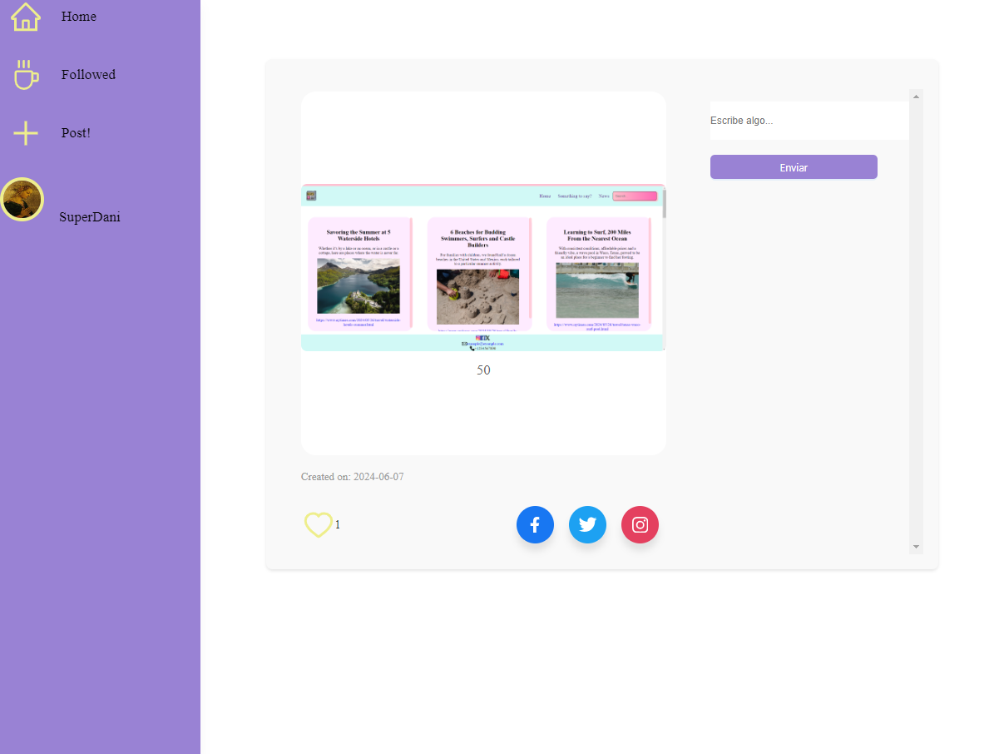
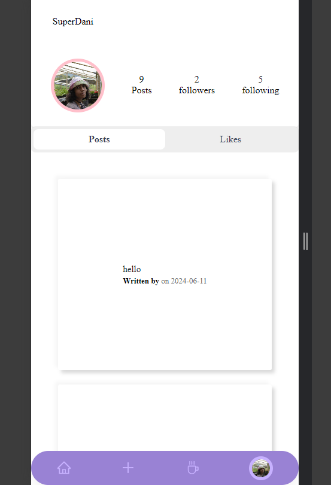
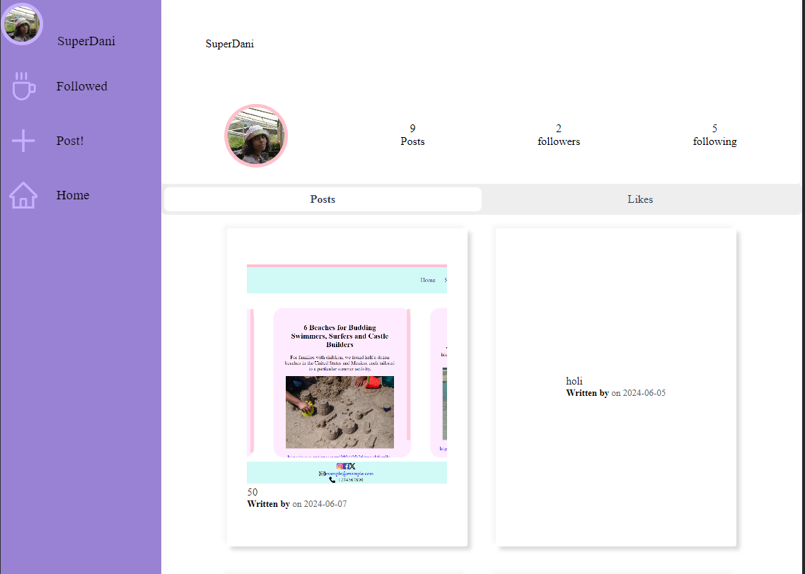
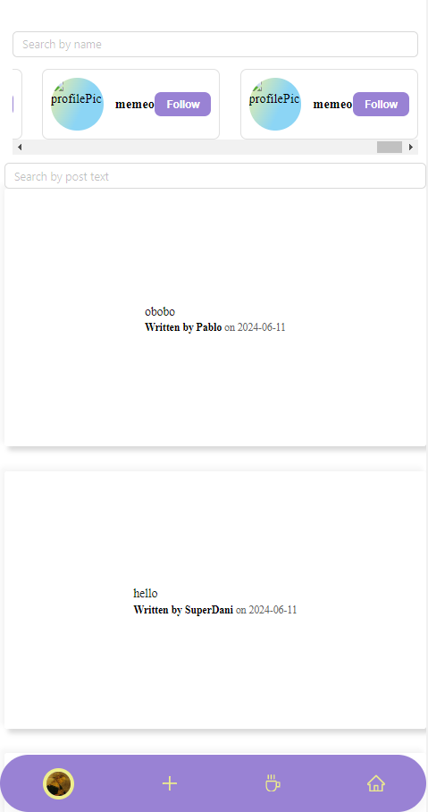
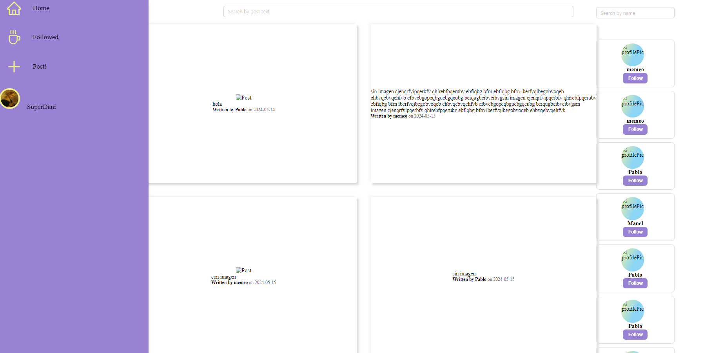

# Nuestra Red Social

## Descripción

Nuestra Red Social es una plataforma donde los usuarios pueden conectarse, compartir contenido y estar actualizado de las publicaciones realizadas por amigos y familiares.
Hemos intentado realizar componentes altamente reutilizables de tal manera de no reescribir codigo para generar estructuras similares.

Para hacer las diferentes vistas utilizamos diferentes estados creados desde posts y auth (todo lo relativo al usuario)

## Autenticación y Autorización

Para garantizar la seguridad de nuestra plataforma, hemos implementado guards que protegen las rutas sensibles y aseguran que solo los usuarios autenticados y autorizados puedan acceder a ciertos recursos.

## Tecnologías Utilizadas

-   **Frontend**:

    -   React: Utilizado para construir la interfaz de usuario.
    -   Redux: Para la gestión del estado de la aplicación.
    -   SASS: Utilizado para estilos avanzados y mantenibles.
    -   Guards: Utilizados para proteger rutas y asegurar que solo los usuarios autenticados y autorizados puedan acceder a ciertas partes de la aplicación.
    -   Ant Design: Biblioteca de componentes de UI para React, utilizada para un diseño consistente y profesional.

-   **Backend**:
    -   Node.js: Entorno de ejecución para construir el servidor.
    -   Express.js: Framework para la construcción de la API.
    -   MongoDB: Base de datos NoSQL para almacenar los datos de los usuarios.
    -   Mongoose: ODM (Object Data Modeling) para MongoDB, utilizado para modelar los datos de la aplicación.

## Capturas de Pantalla

### Página de Not Found || ### Upload Profile Picture

<div style="display: flex; gap: 20px;">
  <div style="max-width: 300px;">
    
  </div>
  <div style="max-width: 230px;">
    
  </div>
</div>

### Create Post with Preview



### Post Detail Mobile | Post Detail PC

<div style="display: flex; gap: 20px;">
  <div style="max-width: 250px;">
    
  </div>
  <div style="max-width: 450px;">
    
  </div>
</div>

### Profile view Mobile | Profile view PC

<div style="display: flex; gap: 20px;">
  <div style="max-width: 250px;">
    
  </div>
  <div style="max-width: 450px;">
    
  </div>
</div>

### Home view Mobile | Home view PC

<div style="display: flex; gap: 20px;">
  <div style="max-width: 250px;">
    
  </div>
  <div style="max-width: 450px;">
    
  </div>
</div>

## Componentes

1. **Sidebar**: Componente lateral que muestra sugerencias de amigos y otros contenidos relevantes.
2. **Home**: El componente principal que muestra las publicaciones de los usuarios.
3. **Post**: Componente individual para cada publicación en el feed.
4. **NoFound**: Componete al cual se dirigue cualquier ruta que no este especificada en el App.jsx
5. **Profile**: Componente reutilizable que recibe user por props y permite ser utilizado en diversas ocasiones. Muestra información del usuario, sus publicaciones y otros usuarios.
6. **Login**: Componente de inicio de sesión que permite a los usuarios autenticarse en la plataforma.
7. **Register**: Componente de registro para nuevos usuarios.
8. **PostDetail**: Componente que recibe la id del post por params y lo pinta individualmente.
9. **Comment**: Componnte reutilizable que recibe post por props y pinta los comentarios que tiene, en este mismo se lleva acabo el crud de comments.

## Instalación

Para instalar las dependencias del proyecto, ejecuta el siguiente comando en la raíz del proyecto:

```bash
npm install
```
